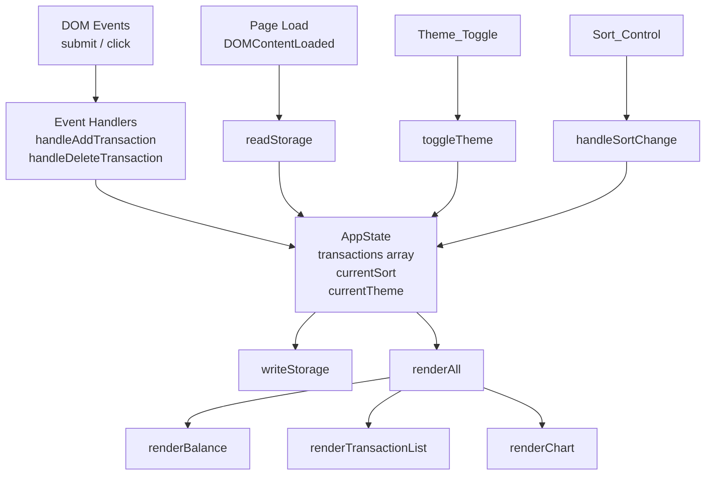

# Design Document — Expense & Budget Visualizer

## Overview

Expense & Budget Visualizer adalah aplikasi web single-page (SPA) tanpa framework yang memungkinkan pengguna mencatat, memvisualisasikan, dan mengelola pengeluaran harian mereka. Seluruh state persisten disimpan di browser LocalStorage; tidak ada server, tidak ada network request selain memuat Chart.js dari CDN.

Tujuan desain utama:

- **Zero-dependency runtime** — hanya HTML5, CSS3, Vanilla JS ES6+, dan Chart.js via CDN.
- **Minimal file footprint** — tepat tiga file: `index.html`, `css/style.css`, `js/app.js`.
- **Single source of truth** — array transaksi di memori (`AppState.transactions`) adalah ground truth; semua komponen UI di-render ulang dari array ini setiap kali state berubah.
- **Defensive storage** — setiap baca/tulis LocalStorage dibungkus try/catch; aplikasi tetap berjalan in-memory jika storage tidak tersedia.

### Penelitian & Keputusan Teknologi

**Chart.js v4 via CDN**
Chart.js v4 mendukung update data tanpa merekonstruksi ulang instance chart: cukup ubah `chart.data.datasets[0].data` dan `chart.data.labels`, lalu panggil `chart.update()`. Cara ini efisien dan tidak menyebabkan flicker. CDN yang digunakan: `https://cdn.jsdelivr.net/npm/chart.js`.

**LocalStorage pattern**
Semua data transaksi disimpan dalam satu key (`ebv_transactions`) sebagai JSON array. Preferensi tema disimpan terpisah di key `ebv_theme`. Pola ini menghindari fragmentasi key dan mempermudah operasi batch read/write.

**CSS Custom Properties untuk theming**
Mode dark/light diimplementasi dengan CSS custom properties (`--color-bg`, `--color-surface`, dll.) yang di-override ketika `<body>` memiliki class `dark`. Pendekatan ini menghilangkan kebutuhan JavaScript untuk memanipulasi style individual.

**Responsive layout dengan CSS Grid**
Layout dua kolom (Transaction List | Chart) pada ≥768px menggunakan `grid-template-columns: 1fr 1fr` dan beralih ke single column dengan `@media (max-width: 767px)`.

---

## Architecture

Aplikasi mengikuti pola **reactive render loop** sederhana:

```
User Action
    │
    ▼
Mutate AppState.transactions (add / delete)
    │
    ▼
Persist to LocalStorage (writeStorage)
    │
    ▼
renderAll() ──► renderBalance()
             ├──► renderTransactionList()
             └──► renderChart()
```

Tidak ada dua-way data binding; seluruh UI di-render ulang dari state setiap kali terjadi mutasi. Karena data bersifat kecil (ratusan entri), performa ini lebih dari cukup tanpa perlu virtual DOM atau incremental patch.



---

## Components and Interfaces

### AppState (in-memory state)

```js
const AppState = {
  transactions: [],   // Array<Transaction> — sumber kebenaran tunggal
  currentSort: 'newest', // 'newest' | 'amount-high' | 'amount-low' | 'category-az'
  currentTheme: 'light',  // 'light' | 'dark'
  storageAvailable: true, // false jika localStorage tidak bisa diakses
  chartInstance: null,    // Chart.js instance, dibuat sekali
};
```

### Public Functions (interface `js/app.js`)

| Fungsi | Signature | Tanggung Jawab |
|---|---|---|
| `readStorage()` | `() → Transaction[]` | Baca & parse JSON dari localStorage |
| `writeStorage(transactions)` | `(Transaction[]) → void` | Serialize & simpan ke localStorage |
| `addTransaction(data)` | `(FormData) → void` | Validasi, buat ID, push ke state, persist, renderAll |
| `deleteTransaction(id)` | `(string) → void` | Filter dari state, persist, renderAll |
| `renderBalance()` | `() → void` | Hitung sum & update DOM Balance_Display |
| `renderTransactionList()` | `() → void` | Build HTML list dengan sort aktif & highlight |
| `renderChart()` | `() → void` | Agregasi per kategori, update chart instance |
| `validateForm(data)` | `(FormData) → ValidationResult` | Kembalikan `{valid, errors}` |
| `formatCurrency(amount)` | `(number) → string` | Format angka ke `"Rp X.XXX"` |
| `aggregateByCategory(transactions)` | `(Transaction[]) → CategoryTotals` | Sum amount per kategori |
| `sortTransactions(transactions, mode)` | `(Transaction[], string) → Transaction[]` | Kembalikan salinan ter-sort |
| `toggleTheme()` | `() → void` | Flip theme, persist ke storage |
| `generateId()` | `() → string` | Kembalikan UUID v4-style unik |

### DOM Elements

```
index.html
├── #balance-display         — Menampilkan total balance
├── #transaction-form        — Form input (submit event)
│   ├── #input-name
│   ├── #input-amount
│   ├── #input-category
│   └── #form-error          — Pesan error validasi
├── #sort-control            — <select> pilihan sort
├── #theme-toggle            — Tombol dark/light
├── #transaction-list        — <ul> daftar transaksi
├── #chart-container         — Wrapper chart
│   └── #expense-chart       — <canvas> Chart.js
└── #chart-empty-message     — Pesan saat chart kosong
```

---

## Data Models

### Transaction

```js
/**
 * @typedef {Object} Transaction
 * @property {string} id        - UUID unik (format: `ebv_${Date.now()}_${Math.random()}`)
 * @property {string} name      - Nama item (1–100 karakter, tidak boleh hanya spasi)
 * @property {number} amount    - Jumlah pengeluaran (> 0, maks 9_999_999_999.99)
 * @property {string} category  - "Food" | "Transport" | "Fun"
 * @property {string} date      - ISO 8601 timestamp (new Date().toISOString())
 */
```

Contoh:
```json
{
  "id": "ebv_1719830400000_0.482",
  "name": "Nasi Padang",
  "amount": 25000,
  "category": "Food",
  "date": "2024-07-01T12:00:00.000Z"
}
```

### CategoryTotals (nilai kembalian `aggregateByCategory`)

```js
/**
 * @typedef {Object} CategoryTotals
 * @property {number} Food
 * @property {number} Transport
 * @property {number} Fun
 */
```

### ValidationResult

```js
/**
 * @typedef {Object} ValidationResult
 * @property {boolean} valid
 * @property {string[]} errors   - Array pesan error (kosong jika valid)
 */
```

### StorageKeys

```js
const STORAGE_KEYS = {
  TRANSACTIONS: 'ebv_transactions',
  THEME: 'ebv_theme',
};
```

---

## Correctness Properties

*A property is a characteristic or behavior that should hold true across all valid executions of a system — essentially, a formal statement about what the system should do. Properties serve as the bridge between human-readable specifications and machine-verifiable correctness guarantees.*

### Property 1: Balance selalu sama dengan jumlah seluruh amount

*For any* array transaksi yang valid (termasuk array kosong), hasil `calculateBalance(transactions)` harus selalu sama dengan `transactions.reduce((sum, t) => sum + t.amount, 0)`.

**Validates: Requirements 1.2, 1.3, 1.5, 1.6**

---

### Property 2: Format mata uang selalu mengikuti pola Rp

*For any* angka non-negatif, hasil `formatCurrency(amount)` harus dimulai dengan `"Rp "`, diikuti digit angka tanpa spasi, dan kelipatan tiga digit dipisahkan dengan titik (`.`), tanpa desimal untuk angka bulat.

**Validates: Requirements 1.4, 3.2**

---

### Property 3: Validasi form menolak semua input tidak valid

*For any* kombinasi input form, `validateForm(data)` harus mengembalikan `{ valid: false }` jika dan hanya jika: Item Name kosong atau seluruh karakternya adalah whitespace, ATAU Amount ≤ 0 atau bukan angka, ATAU Category bukan salah satu dari "Food", "Transport", "Fun".

**Validates: Requirements 2.2, 2.3, 2.4**

---

### Property 4: Penambahan transaksi valid memperbesar array tepat satu elemen

*For any* array transaksi awal dan satu objek transaksi valid baru, setelah operasi add, panjang array harus bertambah tepat 1 dan elemen baru harus dapat ditemukan di array berdasarkan `id`-nya.

**Validates: Requirements 2.5, 2.6**

---

### Property 5: Penghapusan transaksi menghilangkan tepat elemen yang dihapus

*For any* array transaksi dengan setidaknya satu elemen, setelah `deleteTransaction(id)`, array hasil tidak boleh mengandung elemen dengan `id` tersebut, dan semua elemen lainnya harus tetap ada dengan data yang tidak berubah.

**Validates: Requirements 3.4, 8.2**

---

### Property 6: Rendering list selalu mengandung semua field yang diperlukan

*For any* array transaksi non-kosong, HTML yang dihasilkan oleh `renderTransactionList()` harus mengandung teks `name`, teks `formatCurrency(amount)`, teks `category`, dan elemen dengan `data-id` yang bersesuaian untuk setiap transaksi.

**Validates: Requirements 3.1, 3.2**

---

### Property 7: Sorting menghasilkan urutan yang konsisten

*For any* array transaksi, hasil `sortTransactions(transactions, mode)` harus memenuhi:
- mode `'amount-high'`: setiap pasangan elemen berturutan harus `a.amount >= b.amount`
- mode `'amount-low'`: setiap pasangan elemen berturutan harus `a.amount <= b.amount`
- mode `'category-az'`: setiap pasangan elemen berturutan harus `a.category <= b.category` (leksikografis)
- mode `'newest'`: setiap pasangan elemen berturutan harus `new Date(a.date) >= new Date(b.date)`

Selain itu, `sortTransactions` tidak boleh mengubah array asli (pure function).

**Validates: Requirements 6.1, 6.2, 6.3, 6.4, 6.5**

---

### Property 8: Highlight diterapkan hanya pada transaksi di atas threshold

*For any* array transaksi dengan berbagai nilai `amount`, setelah `renderTransactionList()`: setiap item dengan `amount > 500000` harus memiliki class CSS `highlight-high`, dan setiap item dengan `amount <= 500000` tidak boleh memiliki class tersebut.

**Validates: Requirements 7.1, 7.2, 7.3**

---

### Property 9: Agregasi kategori menghasilkan total yang tepat dan mengecualikan kategori kosong

*For any* array transaksi, hasil `aggregateByCategory(transactions)` harus: menjumlahkan amount dengan benar per kategori, dan kategori dengan total = 0 tidak boleh muncul di dataset chart (label maupun data).

**Validates: Requirements 4.1, 4.6**

---

### Property 10: Serialisasi round-trip LocalStorage mempertahankan data

*For any* array objek Transaction yang valid, melakukan `JSON.parse(JSON.stringify(transactions))` harus menghasilkan array yang secara struktural identik dengan input (semua field `id`, `name`, `amount`, `category`, `date` bernilai sama).

**Validates: Requirements 8.1, 8.3**

---

### Property 11: Theme toggle adalah involusi (dua kali toggle kembali ke state awal)

*For any* state tema awal (`'light'` atau `'dark'`), memanggil `toggleTheme()` dua kali berturutan harus mengembalikan `AppState.currentTheme` ke nilai awal.

**Validates: Requirements 5.2, 5.3**

---

## Error Handling

### Kategori Error

| Skenario | Perilaku |
|---|---|
| LocalStorage tidak tersedia | Set `AppState.storageAvailable = false`, tampilkan banner peringatan persisten, lanjutkan in-memory |
| Data JSON di storage rusak | Tampilkan pesan error, panggil `localStorage.removeItem(STORAGE_KEYS.TRANSACTIONS)`, mulai dengan array kosong |
| Pengguna submit form tidak valid | Tampilkan pesan error per-field di `#form-error`, jangan simpan data, jangan reset form |
| Chart.js gagal load dari CDN | `window.Chart` tidak terdefinisi; tampilkan pesan fallback di `#chart-container` |
| Amount overflow (> 9.999.999.999,99) | Validator menolak dengan pesan error spesifik |

### Strategi Error UI

```
┌─────────────────────────────────┐
│  ⚠ Data tidak dapat disimpan.   │  ← Banner (dismissible), muncul di atas halaman
│  Aplikasi berjalan sementara.   │     saat storageAvailable = false
└─────────────────────────────────┘

[Form Error]: "Item Name tidak boleh kosong."   ← Inline di bawah tombol submit
```

### Graceful Degradation

Semua operasi storage dibungkus:

```js
function writeStorage(transactions) {
  if (!AppState.storageAvailable) return;
  try {
    localStorage.setItem(STORAGE_KEYS.TRANSACTIONS, JSON.stringify(transactions));
  } catch (e) {
    AppState.storageAvailable = false;
    showStorageError();
  }
}
```

---

## Testing Strategy

### Prinsip Umum

- **Unit tests** menguji fungsi-fungsi pure secara terisolasi dengan input konkret.
- **Property-based tests** menguji invariant dan universal properties dengan ratusan input random menggunakan [fast-check](https://fast-check.dev/) (JavaScript PBT library).
- Keduanya berjalan di browser tanpa memerlukan Node.js build tool — file test dapat dijalankan langsung dengan `<script type="module">` di browser atau dengan Node.js minimal.

### PBT Library

**fast-check** dipilih karena:
- Berjalan di browser (ESM compatible) dan Node.js tanpa konfigurasi
- Menyediakan arbitrary generators siap pakai (strings, numbers, arrays, objects)
- Menampilkan shrinking otomatis untuk menemukan counterexample minimal

Konfigurasi: minimum **100 iterasi** per properti (`numRuns: 100` di options).

Tag format per test: `// Feature: expense-budget-visualizer, Property N: <teks properti>`

### Unit Tests

| Test | Fungsi | Skenario |
|---|---|---|
| Balance display awal | `renderBalance()` | Halaman pertama dimuat, tidak ada transaksi |
| Form field tersedia | DOM | Verifikasi `#input-name`, `#input-amount`, `#input-category` ada |
| Error storage | `readStorage()` | Mock localStorage throw, verifikasi fallback |
| Empty list message | `renderTransactionList()` | Array kosong → tampilkan "Belum ada transaksi." |
| Empty chart message | `renderChart()` | Array kosong → tampilkan pesan no-data |
| Theme persistence | `toggleTheme()` | Setelah toggle, localStorage mengandung key `ebv_theme` |
| Storage corrupt | `readStorage()` | Data JSON invalid → kosongkan storage, return `[]` |

### Property-Based Tests

Setiap properti dari bagian Correctness Properties diimplementasi sebagai satu property test:

```
// Feature: expense-budget-visualizer, Property 1: Balance selalu sama dengan sum amount
fc.assert(fc.property(
  fc.array(arbitraryTransaction()),
  (transactions) => calculateBalance(transactions) === transactions.reduce((s, t) => s + t.amount, 0)
), { numRuns: 100 });
```

| Property | Arbitrary Generator | Assertion |
|---|---|---|
| P1: Balance calculation | `fc.array(arbitraryTransaction())` | `calculateBalance(txs) === txs.reduce(sum, 0)` |
| P2: Format currency | `fc.nat()` (non-negatif) | Output match `/^Rp \d{1,3}(\.\d{3})*$/` |
| P3: Validasi form | `fc.record({name: fc.string(), amount: fc.anything(), category: fc.string()})` | valid iff semua aturan terpenuhi |
| P4: Add transaction | `fc.array(arbitraryTransaction())` + `arbitraryTransaction()` | length+1, id ditemukan |
| P5: Delete transaction | `fc.array(arbitraryTransaction(), {minLength:1})` | id hilang, sisanya utuh |
| P6: Render list fields | `fc.array(arbitraryTransaction(), {minLength:1})` | semua field hadir di HTML |
| P7: Sorting konsisten | `fc.array(arbitraryTransaction())` × mode | ordered pair invariant terpenuhi |
| P8: Highlight threshold | `fc.array(arbitraryTransaction())` | highlight iff amount > 500000 |
| P9: Agregasi kategori | `fc.array(arbitraryTransaction())` | totals benar, no zero-amount category |
| P10: Round-trip storage | `fc.array(arbitraryTransaction())` | parse(stringify(txs)) deep-equal txs |
| P11: Theme toggle involusi | `fc.constantFrom('light', 'dark')` | toggle dua kali kembali ke awal |

### Arbitrary Generator

```js
function arbitraryTransaction() {
  return fc.record({
    id: fc.string({ minLength: 1 }),
    name: fc.string({ minLength: 1, maxLength: 100 }).filter(s => s.trim().length > 0),
    amount: fc.float({ min: 0.01, max: 9_999_999_999 }),
    category: fc.constantFrom('Food', 'Transport', 'Fun'),
    date: fc.date({ min: new Date('2000-01-01'), max: new Date('2099-12-31') })
              .map(d => d.toISOString()),
  });
}
```

### Integration Tests (Manual)

| Skenario | Cara Verifikasi |
|---|---|
| Data persist setelah refresh | Tambah transaksi → F5 → verifikasi transaksi masih ada |
| Dark mode persist | Toggle ke dark → F5 → verifikasi dark mode aktif |
| Chart update otomatis | Tambah/hapus transaksi → pie chart berubah tanpa reload |
| Responsif 768px | Resize browser ke 767px dan 768px → verifikasi layout beralih |
| Touch target size | DevTools → mobile view → verifikasi semua tombol ≥ 44×44px |

---
